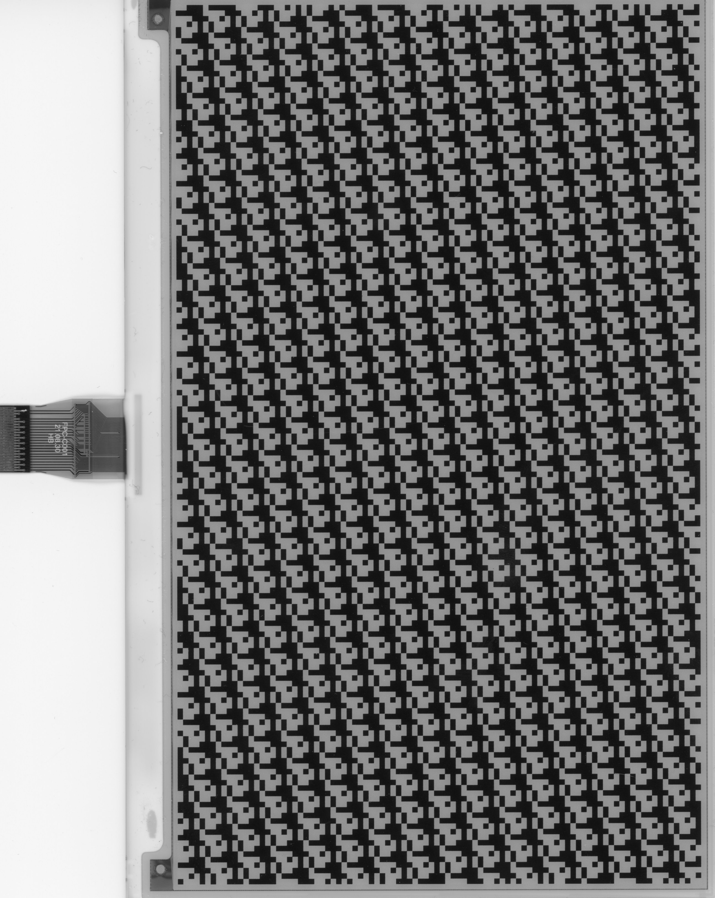
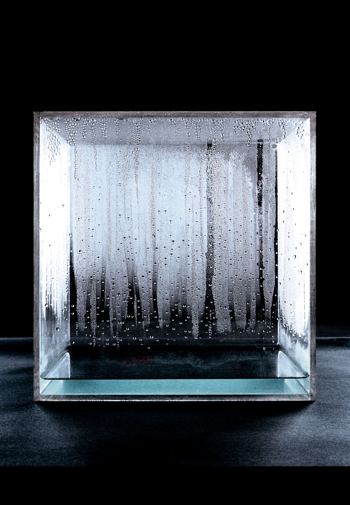
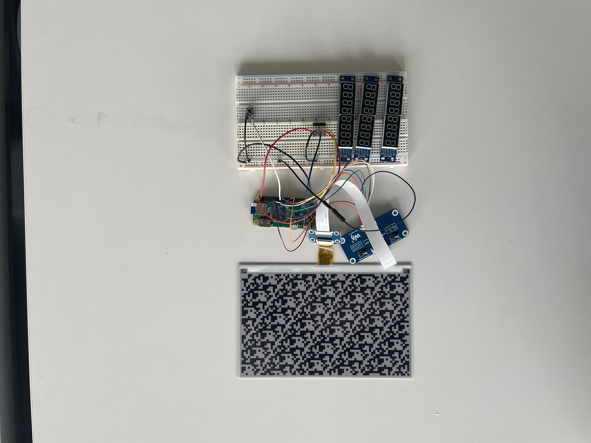

## 2025年度卒研発表会

# 電子ペーパーを用いた環境決定的変数による装置統合型ビジュアル生成手法の研究《createdAt:》制作を通して

ネットワークデザインスタジオ - 坂村 空介

---

<!-- _class: center -->

## 《createdAt:》

# 「装置」・「環境」・「生成されるビジュアル」の関係性を不可分にしたデジタルアート

<!-- 今回制作した作品、createdAtは、装置・環境・生成されるビジュアルの3要素の関係性を不可分にしたデジタルアートです。 -->

---

<!-- _class: center -->

## 背景

# パラメトリックなデジタルアートにおける「唯一性・固有性」の希薄化

<!-- 背景として、パラメトリックなデジタルアートにおける唯一性・固有性の希薄化を問題として設定しました。 僕自身、コンピュータのアルゴリズムと乱数によって生成されるGenerativeArtを制作しており、かねてより、これらの作品の唯一性や固有性について思いをめぐらせていました。それでは、これらのワードについて1つずつ取り上げていきます。 -->

---

<!-- _class: center -->

- デジタルデータ: 本質的に複製・再配置が容易
- パラメトリック: 作家性と意思の介在
- 生成過程の重要性: 多くの場合に乱数が用いられる

<!-- まず、デジタルデータの複製可能性についてです。デジタルデータは本質的に複製・再配置が容易であり、その唯一性は担保されません。今回はこのデジタルデータの唯一性こそが第一のテーマとなっています。次に、パラメトリックについて、多くの場合これには乱数が利用されますが、これらの値は作家によって特定のパターンにマッピングされ、そこには当然作家の意思が反映されます。後ほど触れますが、SystemArtの文脈においては、作品が生成される過程に比重が置かれるため、前提条件的にマッピングが行われることは望ましくありません。最後に、生成過程の固有性についてです。GenerativeArtにおいては乱数が利用されますが、これはコンピュータによって完全にランダムに決定される値であり、そこに作品と接続する文脈が存在しません。これは作品自体のナラティブの奥行きに制限をかけてしまいます。 -->

---

<!-- _class: center -->

## 課題: デジタルデータの複製可能性

# NFTによるデジタルアートの唯一性の担保

<!-- まずは、NFTによるデジタルアートの唯一性の担保について取り上げます。 -->

---

## NFTによるデジタルアートの唯一性の担保

# NFTの唯一性の担保はあくまでも「外部的」

- あくまでも付加情報的な担保手法であり、作品生成・提示の構造自体を大きく変えたものではない
- →内部的にその唯一性を担保する方法を研究

<!-- NFTとは、非代替性トークンの略称であり、ブロックチェーン技術を用いたデジタルアート作品の唯一性を担保する技術のことです。しかし、これは外部的・付加価値的ににその唯一性を保証するものであり、内部的にデジタルデータの唯一性を保証するものではありません。今回は、これについて内部的にその唯一性を担保する方法を研究しました-->
---

<!-- _class: center -->

## 事例: 作家性と意思の介在

# 20世紀美術における、作家による意図を排除した作品

<!-- # 20世紀美術における偶然性と外部要因を利用した作家性を排除した作品の事例 -->

<!-- 次に、作家性と意思の介在について、20世紀美術における偶然性と外部要因を利用した作家性を排除した作品の事例を紹介します。 -->

---

## 作家性を排除した作品制作手法1

# アクション・ペインティング

Jackson Pollock
空中から塗料を滴らせることで抽象的な描画を行う

<!-- Jackson Pollockは、アクションペインティングにおいて、空中から塗料を滴らせることによって、抽象的な描画を行いました。 -->

---

## 作家性を排除した作品制作手法2

# チャンス・オペレーション

John Cage
コイントスによって作譜するなど、作家による意図を排除するために偶然性を利用して制作

<!-- また、John Cageは、チャンスオペレーションにおいて、作家性を排除するためにコイントスによって作譜するなど、偶然性を利用して制作を行いました。このように、20世紀美術においては、ランダムネスを利用してあえて作家性を排除する制作手法をとるアーティストが登場しました。 -->

---

<!-- _class: center -->

## 生成過程の重要性

# System Artのなんちゃら

<!-- 次に、生成過程の重要性についてです。乱数を用いて作家性を排除するという手法は翻って、作品のナラティブの希薄化という問題があります。 -->

---

## 生成過程の重要性

# System Art

SystemArtの文脈では、アート作品は「生成される過程」こそが本質であり、環境との相互作用が重要

<!-- SystemArtの文脈では、アート作品は「生成される過程」こそが本質であり、環境との相互作用が重要視されます。よって、コンピュータによって完全にランダムに生成される乱数を利用することはその過程におけるナラティブを希薄化させる恐れがあります。 -->

---

# 《createdAt:》

- 場所・時間・実行者による変数を用いたGenerative Art
- 電子ペーパーに表示されて初めて視覚化

<!-- 今回制作した作品、createdAtでは、これらの問題意識を考慮したものになっています。生成される場所・時間・実行者によって決定される変数を利用したGenerative Artです。ピクセルデータは電子ペーパーに直接与えられ、電子ペーパーに表示されることによって初めて作品として視覚化されます。作品情報を画像データのようにデジタルデータとして保存しないことによって、複製可能性を排除しながら、装置とビジュアル作品が不可分な状態を実現しました。-->
---

---

## 仕組みの解説 01

# 環境決定的変数

- 時刻: UNIX Time
- 場所: Latitude, Longitude
- 実行者: Button Pressing Duration

<!-- 環境決定的変数とは、具体的に3つの情報から決定されます。1つ目が生成処理が実行された時間。これはUNIX Timeという秒数によるカウントを用います。次に場所情報。こちらは緯度経度情報を2つの値として取得します。時間と場所情報は10進数で与えられますが、この情報を2進数に変換し、電子ペーパーのピクセル情報とします。電子ペーパーは白黒の2色のものを採用しているため、これらの値が直接ビジュアルに影響します。最後が実行者による変数です。これは、実行ボタンを押した際の時間を取得しており、ピクセル情報の割り当てかたに影響します。 -->

---

## 仕組みの解説 02

# 電子ペーパー

- 電子ペーパーに表示される際、初めて視覚情報となる
- 書き込まれた瞬間にピクセルデータは消滅し、再現不可能になる
<!-- これらの値は実行時にのみ取得され保存されず、ピクセルデータとして変換され電子ペーパーに渡され時点でデータとしては消滅します。よって、これらの情報は視覚情報としてのみ電子ペーパー常に保存され、複製することはできません。 -->

---

<!-- _class: center -->

## 結論

# アートの文脈を辿りながら、実践的にデジタル作品の固有性についての再考

# 電子ペーパーを用いた装置統合型ビジュアル生成手法を提案
